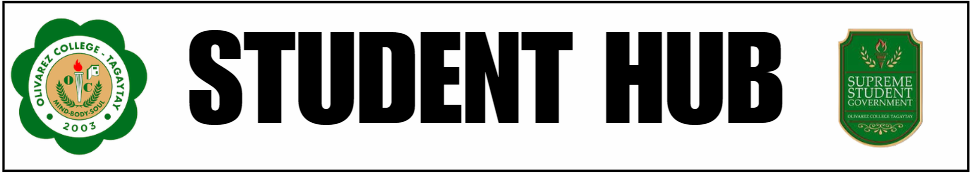
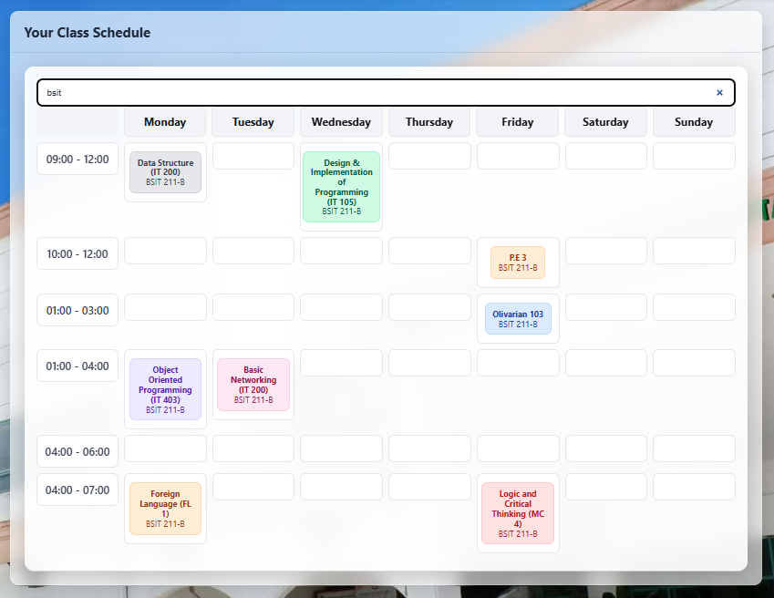
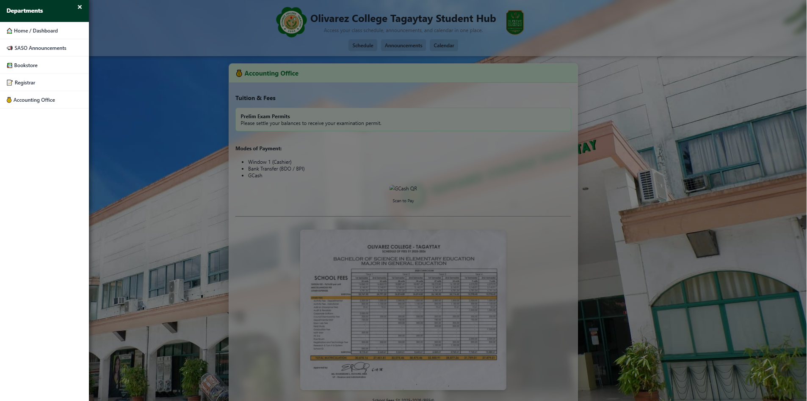
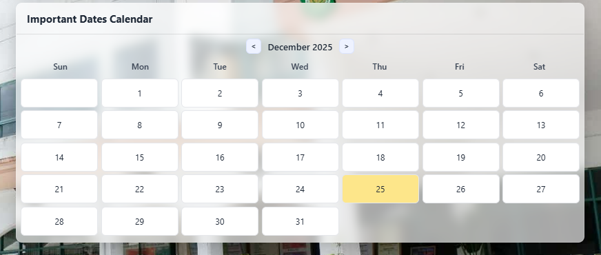

# **Olivarez College Tagaytay Student Hub**

The **Student Hub** is an integrated online platform designed to provide Olivarez College Tagaytay students with convenient access to essential academic and institutional resources. It serves as a centralized digital environment where students can stay informed about campus announcements, academic schedules, class updates, school policies, and upcoming events.
---

## **Overview**
The Olivarez College Tagaytay Student Hub is designed as an all-in-one online platform that consolidates important student information and services. This documentation provides an outline of the hub's purpose, structure, and functional components.

---

## **Features of the Student Hub**

### **Academic Resources**
- Class schedules  
- Course information
    

### **School Department Updates**
  -   Updated lists of Tuition
  -   Bookstore Stocks Updates
  -   Registar Requirements
  

### **School Calendar**
  - Accesible School Calendar that provides important events trough out the year
  

---
## **We Are Group 1**

